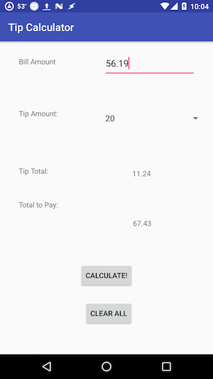

**Simple Tip Calculator**

This is a simple tip calculator built for my own purposes. It contains the basic functionality of calculating a tip based on the bill amount and a user-defined percentage (10, 15, 20, or 25). The tip amount and total bill amount (including tip) then populate to the screen. The user can also reset the app easily.

*Sources I found useful:*

[SO post on how to round a double in Java](https://stackoverflow.com/questions/8819842/best-way-to-format-a-double-value-to-2-decimal-places)
